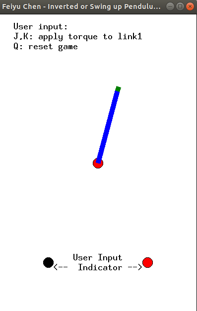

# Game AI: 
# Using Deep Q-network to play Swing-up Pendulum Game  

Final Project of EECS 395/495: Optimization Techniques for Machine Learning and Deep Learning  
Instructor: Prof. Jeremy Watt  
Student: Feiyu Chen  

## Video Intro
I made a video to introduce how to run my codes:  
http://feiyuchen.com/wp-content/uploads/DQN_swing_up_pendulum.mp4

## Contents
1. Introction
2. How to Run
3. Files and Codes
4. Set up DQN
5. Training and Results
6. Conclusion
7. References

# 1. Introction

## 1.1 Game
The goal of the game is to swing up a pendulum (Swing-up Pendulum) and keep it inverted (Inverted Pendulum).

The human or AI player could input 3 types of torque (zero, positive, negative) by pressing "j" or "k".

The GUI of the game utilizes the Python's "tkinter" library. The motion of link is solved from Eular-Lagrange Equations.

A figure of the game is shown below: 

  
Figure 1.1 The Swing-up or Inverted Pendulum game.


## 1.1 AI (Reinforcement Learning, Deep Q-network)


I use reinforcement learning algorithm to train AI to play this game.

What is reinforcement learning (RL)?  
"Robot: take action -> new state -> receive reward -> take action -> ... "  

The main idea of RL looks like this:  
There is a robot with state Si. It can take take an action Aj from a set of actions. Every time the robot takes an action, it receives a reward. Based on the reward, the robot could know if it is good or bad of taking this action. As training goes, the robot could build up a "Quality Table", whose element [i,j] is the quality of taking action Aj at state Si. By checking this table, the robot could know which action has the largest quality, and that is the action the robot should take at the current state. This is the idea of Q-learning algorithm, one of the RL algorithm.

The reinforcement learning algorithm I adopted is called **Deep Q-Network (DQN)**.   
It's an modified version of the Q-learning, by using **Neural Network (NN)** to take the role of Quality Table. We can train this Neural Network to fit it to the real Quality Table, and then evaluate the quality of taking action A at state S by checking the output of NN. Two extra techniques called **Experience Replay** and **Fixed Q-targets** are also included for updating neural network's weights.

During the training, we can obtain the difference between the Estimated Quality and Real Quality (more specifically, the estimated Real Quality). By back proporgation of the error through NN, and using optimization techniques such as the Momentum we learned, we can optimize the weights and make the NN converge to the real quality table.

The paper of DQN is [here](https://storage.googleapis.com/deepmind-media/dqn/DQNNaturePaper.pdf).   As for me, I read this Chinese [tutorial](https://morvanzhou.github.io/tutorials/) to learn how to train DQN.

-------------------------------------------------------------------------------------------

# 2. How to Run

## 2.1 Dependency
You need following things:
* Python 3.6  
* tkinter (a Python library for creating GUI)
* tensorflow  
* other common libraries. 

## 2.2 Play game by yourself 

Run this:
> $ python3 src/pendulum_simulation.py

You can press J and K to apply torque. Your goal is to swing up the pendulum and keep it inverted.


## 2.3 Play game by AI 

Load the game and see how well-trained DQN plays it:  

> $ python3 src/run_this.py --testing true --swing_up_pend true --random_init true

Arguments:
* --testing: Testing mode. The game engine will be played in real time.
* --swing_up_pend: If false, the pendulum starts with an inverted state.
* --random_init: If true, the intial state is random. If false, it starts from hanging-down pose.  
Run this for more detials: $ python3 src/run_this.py -h

(Note: If you retrain the DQN, the weights in "/weights" will be overlayed, and you need to manually copy and paste the well-trained weights from "/FinalResults/stage4_weights" to "/weights".)

## 2.4 Train AI from scratch
To train the model from scratch, I used 4 steps:   
> $ python3 src/run_this.py --testing false --swing_up_pend false --retrain true    

> $ python3 src/run_this.py --testing false --swing_up_pend false --random_init true    

> $ python3 src/run_this.py --testing false --swing_up_pend true --random_init true  

> $ python3 src/run_this.py --testing false --swing_up_pend true   

The detials are described in Section "5. Training and Results".


-------------------------------------------------------------------------------------------

# 3. Files and Codes
## 3.1 [pendulum_window.py](src/pendulum_window.py)  
**This implements the geometry of the pendulum.**  
It creates a window and draws a pendulum.   
> $ python3 src/pendulum_window.py  

Run it, and the user could press keyboard "a" and "d" to change the angle of the pendulum.  

## 3.2 [pendulum_simulation.py](src/pendulum_simulation.py)  
**This implements the dynamics of the simualted pendulum.**  
It inherits the above class, adds the dynamics to compute the angular acceleration, and simulates the motion of the pendulum. You can also modify friction and noise to test if the trained AI is robust.  
> $ python3 src/pendulum_simulation.py  

Run it, and the user could press keyboard "j" and "k" to apply torque to this link.

## 3.3 [DQN_brain.py](src/DQN_brain.py)  
**This implements the DQN's Neural Network.**   

This code is largely from this Github tutorial: https://morvanzhou.github.io/tutorials/. I only changed the network structure, tuned some arguments, add some parameters for printing and save/load, and modified the plot function.

Details about the setting and training of DQN is described in Section **4. Set up DQN**.

The member functions of this class are:
``` Python
class DeepQNetwork:
    def __init__(
            self,
            n_actions,
            n_states,
            learning_rate=0.01,
            reward_decay=0.8,
            e_greedy=0.9,
            replace_target_iter=300,
            memory_size=500,
            batch_size=32,
            e_greedy_increment=0.001,
            output_graph=False,
            record_history=True,
            observation_interval=0.01,
    )
    def _build_net(self)
    def store_transition(self, s, a, r, s_)
    def choose_action(self, states)
    def learn(self)
    def save_model(self, model_path=None)
    def plot_cost(self)
```

## 3.4 [run_this.py](src/run_this.py)  
**This is the main file. User can run this file to train/test AI for swinging up pendulum.**  
This script inherits the pendulum from "pendulum_simulation.py" and turns it a "robot" which has states, actions, and rewards. It then imports the DQN_brain, and starts a loop to train/test the AI to play the game.

You can input different command-line arguements, and run it to see the final result.

Two major arguements needs to be set:
1. Inverted_Pendulum=False
    * If true, the pendulum starts with an inverted state.
    * If false, the pendulum is hanging downwards.

2. Training_Mode=False
    * If true, the programs will keep on training the DQN (or you can set to retrain). The animation will be like 20 times faster than real time.
    * If false, it's in testing mode. You can view how AI swings up the pendulum in a very efficient manner.

Besides, you can also set "Random_Init_Pose=True", and the pendulum will start with random pose, so as to demonstrate the robustness of the trained DQN.

Some member functions of the pendulum is put here. There are used for DQN.
``` Python
class RL_Pendulum(Pendulum):
    def __init__(self, q_init, dq_init)
    def reset(self, q1_init=None, dq1_init=None)
    def get_states(self)
    def step(self, action, t) # take action, do simulation for t seconds, return new state
    def compute_reward(self, states)
```

## 3.5 [weights/](weights/)
This is where the NN's weights are stored.

If you set "--testing" to "false" and "--retrain" to "false", the program will read the weights from this folder and keep on training these weights. After training, the weights will be saved here and overlay the original weights.


## 3.6 [cost_history/](cost_history/)
This is for temporarily storing the cost history of the training results.

## 3.7 [FinalResults/](FinalResults/)
The weights and cost histories of each training stage are put here.  
This is the final data result of my project.

-------------------------------------------------------------------------------------------

# 4. Set up DQN

For me, this might be the most useful part of the project. I gained some understandings and thoughts about how to train Deep Q-Network through the process of tuning many of its settings and parameters.

I will describe in details in the following sections about how to set up DQN, my testing procedures, and what I learned.

## 4.1 Simulation settings

Some major params for simulation is set as follows:
* Torque=2: The torque applied by player is set as 2. It takes at least 3 swings (e.g., left, right, left) to swing up the pendulum.  
* Friction=-0.1*dq  
* Noise=(+,-)0.01*Random()  
* Low-level simulation time for updating the state of pendulum is 0.001s.  

Other settings related to training the DQN:
* t_train=0.01: While training the DQN, the period of taking action and makeing observation is 0.01s.  
* For visualation, the refresh time of game animation is set as 0.1s during the training stage, and set as 0.01s in testing stage. Besides, during training, the game is not display in real time, but about 20 times faster than real time.

The simulation time is about 20 times faster than real-world time. You may even increase it by disable the visualization.

## 4.2 Setting of States of pendulum
The states of a pendulum is the angle $q$ and angular velocity $dq$.

The key points are:
* Set q in [-Pi, Pi]. We know that Neural Network is for fitting a function. Restricting the definition domain makes it converge faster and better. 
* Choose the coordinate so that q=0 when the pendulum is upwards. I believe this is a better choice, since it makes $q$ continuous at the goal state (upwards), and makes the discontinous point in the farthest point (q=Pi, downwards).
* Not using states (x,y,dq), where $x=l*cos(q)$ and $y=l*sin(q)$, to replace (q,dq). Though it solves the discontinuousty problem, it increases the states dimension from 2 to 3 and makes network difficult to train. For example, when training the pendulum to swing up (where x≈0, y≈-l), the weights associated with keeping pendulum inverted (x≈0, y≈l) will be affected since they both have x≈0 (which won't happen when using $q$). In other words, training task A ruins the weights of task B.

## 4.3 Reward function
The "Swing up a pendulum" actually involves two tasks:
1. Swing up the pendulum
2. Keep it inverted

I tested two different types of rewards. The first cannot work. The second works. The two rewards are:
1. $R=-c_1 q^2-c_2 dq^2$  
    Though this is beautiful and fits the tuition that we want to make $q=0$ and $dq=0$, it actually cannot work. The pendulum always gets into the local minimum in the half way of swinging up.  
    
    Reason: Image, when you play this game, you need to swing the pendulum to left, to right, to left for several times to make pendulum acquire enough energy for the final swinging up. However, in case of using this reward, the pendulum will be unwilling to swing downwards, since both $-q^2$ and $-dq^2$ decrease. Thus, it falls into a local minumum.  
    
    
2. Using $R_1=c_3-c_4 (c_5-Abs(dq))^2$ to swing up the pendulum when $q>\frac{2}{3} Pi$, and using $R_2=-c_1 q^2-c_2 dq^2$ to drive the pendulum inverted when $q \leqslant \frac{2}{3} Pi$. 

    In this way, the pendulum will want to achieve a speed of $c_5$ during the swing-up stage. And this can lead to a successful training.
    Meanwhile, you need to pay attention and make sure the rewards is roughly continuous.

The reward I adopted is:
``` Python
r = lambda q_, dq_: -(q_**2 + 0.01*dq_**2)
if abs_q<pi*2/3:
    reward= r(abs_q,abs_dq)
else:
    reward= r(pi*2/3,4)-0.1*(4.0-abs_dq)**2
``` 
The weights between q and dq took me some time to finetune.

## 4.4 Structure of Neural Network

* Input:
2 neurons (states: q and dq)  
* Hidden: 4 fully connected layers  
Sizes: 10, 15, 20, 15.  
Use Relu for activation.  
* Output: 3 neurous  
Fully connected and direct output.  
The three classes are: No toruque, counter-clockwise, or clockwise torque.

How I choose this structure?  
I start from 1 hidden layer, use it to train the inverted pendulum, and see if the pendulum will work well in 2000 simulation seconds. If it works well, I will increase the depth. When the depth goes to 5, the inverted pendulum cannot be converged even after 5000 seconds. On the other hand, 4 layers is good, so I set it to 4. This leaves enough capacity for training the "swing up pendulum".

I also tried "dropout" or changing the output layer to "softmax". But the converge becomes very slow. I don't know why. Since I'm still a novice in deep learning and reinforcement, I didn't further investigated these parameters.

## 4.5 Tuning parameters
I conclude some experience for tuning the pamameters.

* learning_rate for Gradient Descent  
    I used "RMSPropOptimizer" and set learning rate as 0.0005. I've 
    tried a range from 0.0001 and 0.01. My conclusion is that 0.01 is too large, because the pendulum never swing itself up. I think the way to tune this is just to keep decreasing it by 1/10 until get a good perforcement. 
    
    
* reward_decay  
    Since the pendulum is taking action and making observations as fast as 1/0.01=100 times/second, the reward_decay should be close to 1, where I set as 0.995.
    
    0.995^500=0.08, so roughly the future rewards in 5 seconds are considered.

    The larger it is, the further future is considered.
    
    
* e-greedy  
    This decides the probability for pendulumn to choose the best action to take. The smaller it is, the training explores more unknown spaces. I set it as 0.95 here.
    
    
* Others  
    There are other important params such as: replace_target_iter, batch_size, memory_size. They are definitely important, but I just don't have a good idea about how to set them. I've tuned them for several values, but there is no apparent conclusion. One thing I do know is that when making faster observation, these values should be inceased.


-------------------------------------------------------------------------------------------


## 5. Training and Results

It would be very difficult to train this swing-up pendulum from "scratch", since there is too few chances for the pendulum to stay upright and experience the success. Thus, I trained it in two phases:  
1. First train an inverted pendulum.
2. Then train the swinging up.

More specifically, I trained this in 4 different stages: 

(1) Inverted pendulum, fixed start.  
(2) Inverted pendulum, random start.  
(3) Swing-up pendulum, random start.  
(4) Swing-up pendulum, fixed start.   

The details and results are as follows:

### 5.1 Inverted pendulum, fixed start

What to do: Train an inverted pendulum which starts from upright position.

Command:
> $ python3 src/run_this.py --testing false --swing_up_pend false --retrain true

Reason: This is the simpliest task. Do this first, so later when training swinging up pendulum, it has a better chance to stay up-right and receives more reward.

Training time: Total simulation time=2008.91s. Real world training time=125.64s.

Cost function:  

<center>Figure 5.1. Cost function of training stage 1.</center>

Result:
The pendulum can always be kept inverted.  
The cost function is descending.

### 5.2 Inverted pendulum, random start.

What to do: Train an inverted pendulum, which starts randomly at an angle between $[-pi/3, pi/3]$ and a random velocity towards the center.

Command:
> $ python3 src/run_this.py --testing false --swing_up_pend false --random_init true

Reason: This imitates the scene when a pendulum is swinged up. It's also for improving the chance of making the swing-up pendulum converges to the inverted state.

Training time: Total simulation time=3017.96s. Real world training time=232.57s.

Cost function:  

<center>Figure 5.2. Cost function of training stage 2.</center>

Result:
The pendulum can goes to the inverted state if it has a good starting pose.

Though the cost function is not descending, the actual performance of the game AI is increasing (which was seen from the game animation). The tutorial I read said that this is the correct curve for the cost function of Reinforcement learning. 

The reasons for those peaks, that I can think of, are:
1. The robot is exploring a new {state, action} pair.
2. The robot is randomly pick action (I set this chance as 5%).


### 5.3 Swing-up pendulum, random start.  

What to do: Train the swing-up pendulum, with random initial angle and velocity.

Command:
> $ python3 src/run_this.py --testing false --swing_up_pend true --random_init true

Reason: After experiment, I found that it would still be too difficult for the pendulum to start from the hanging-down pose. So I use this training stage to make the task converges faster.

Training time: Total simulation time=31111.60s. Real world training time=2005.30s.

Cost function:  

<center>Figure 5.3. Cost function of training stage 3.</center>

Result:
This is the most crutial step for training inverted pendulum. I trained it for 31111.60s in the simulated game, to ensure the training has covered most of the state space, and to ensure the pendulum can always swing to the inverted state. 


### 5.4 Swing-up pendulum, fixed start.

What to do: Train the swing-up pendulum, with static initial angle of $-pi$.


Command:
> $ python3 src/run_this.py --testing false --swing_up_pend true

Reason: This is the final training stage, which must make sure the pendulum can be swinged up from the initial static state.

Training time: Total simulation time=6008.90s. Real world training time=400.10s.

Cost function:  

<center>Figure 5.4. Cost function of training stage 4.</center>

Result:
The AI plays the game pretty well!
Please see my video introduction or play the game by yourself!


# 6. Conclusion

In this project, I used Deep Q-network (DQN) to train an AI to swing up a pendulum and keep it inverted.

Run this command to see how AI plays the game:  
> python3 src/run_this.py --testing true --swing_up_pend true --random_init true

# 7. References
* The core AI of my homework, i.e. Deep Q-Network, references this Github tutorial: https://morvanzhou.github.io/tutorials/. Thanks Morvan!
* [Deepmind's website for DQN](https://deepmind.com/research/dqn/)
* Paper: [Human-level control through deep reinforcement
learning](https://storage.googleapis.com/deepmind-media/dqn/DQNNaturePaper.pdf)

